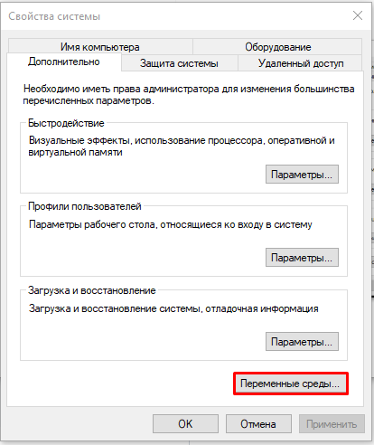
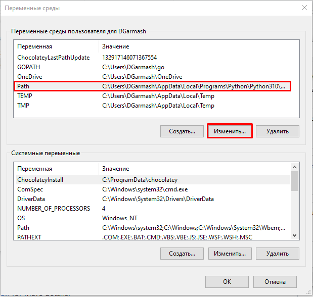
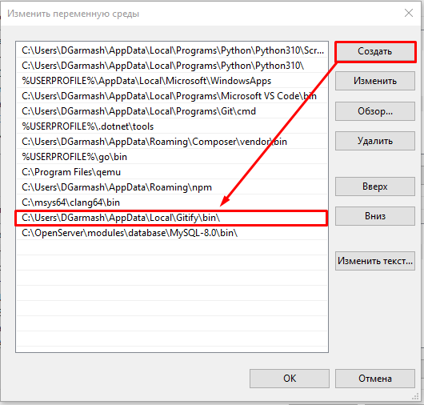

# Установка Gitify

## Установка через Composer

```bash
composer global require modmore/gitify:^2
```

## Установка через Git

Копируем репозиторий в любую удобную папку

```bash
git clone https://github.com/modmore/Gitify.git Gitify
cd Gitify
composer install
chmod +x bin/gitify
```

## Глобальный доступ

Для глобального доступа необходимо прописать путь до исполняемого файлы в переменную среды

Открываем свойства системы и нажимаем на переменные окружения:



В списке выбираем Path и нажимаем изменить:



Нажимаем кнопку создать, в новое поле вставляем путь до папки, куда произвели `git clone` + \bin, в котором лежит файл gitify



Нажимаем ОК на каждое окно и перезапускаем консоль